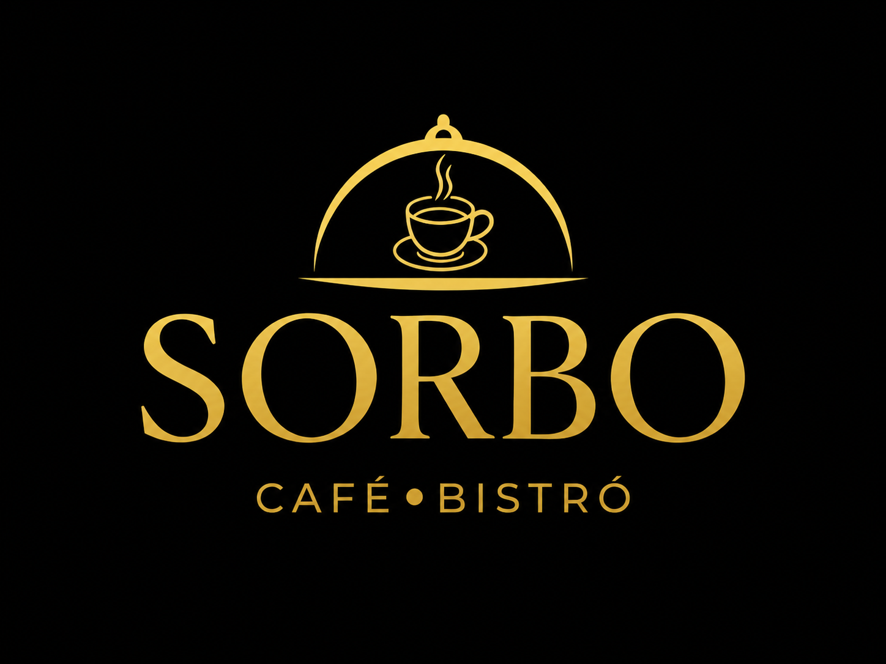

<p align="center">
  
</p>

<h1 align="center">Sorbo Café • Bistró — Web App</h1>

<p align="center">
  <strong>Premium Progressive Web App for Sorbo Café • Bistró</strong><br/>
  Elegante · Moderna · Provocativa · Instalable
</p>

<p align="center">
  
  
  
  
  
  
</p>

---

## About

Sorbo App is a mobile-first Progressive Web App for **Sorbo Café • Bistró**, a
restaurant and coffee shop in Venezuela.

### Current development status — June 2026

The **Phase 0/1 foundation is stabilized**: strict TypeScript, CI, design system,
accessible UI primitives, route transitions, error handling, PWA generation, cinematic
splash and onboarding are in place.

The current branch also contains working implementations for auth, home, menu, product
detail, persistent cart, checkout through WhatsApp, reservations and profile. These flows
still require a correctly configured Supabase project, schema and production data before
they can be considered production-ready.

#### Implemented now

- **Cinematic splash** using GSAP and lightweight CSS particles
- **Onboarding** with swipe navigation and persisted completion state
- **Supabase auth** for email, Google OAuth and guest mode
- **Home, menu and product detail** backed by Supabase services
- **Persistent cart and checkout** with order registration and WhatsApp handoff
- **Reservation request flow** through WhatsApp
- **PWA service worker** with runtime caching for Google Fonts
- **Dark Luxury design system**, accessibility improvements and responsive mobile layout

#### Roadmap / not production-ready

- Admin dashboard and CRUD management
- Order history and order tracking routes
- Advanced recommendation and loyalty systems
- 3D table selection, push notifications and install-prompt polish
- ScrollTrigger experiences, Lenis smooth scrolling and tsParticles effects
- Production Supabase migrations and verified production deployment

---

## Tech Stack

| Layer | Technology | Current use |
|-------|-----------|-------------|
| **UI** | React 19 + TypeScript | Active |
| **Bundler** | Vite 6 | Active |
| **Styling** | Tailwind CSS 4 | Active through CSS-first `@theme` tokens |
| **Animation** | GSAP + Framer Motion | GSAP splash + Framer Motion UI/transitions |
| **Smooth Scroll** | Lenis | Installed, roadmap |
| **Particles** | CSS + tsParticles | CSS particles active; tsParticles installed, roadmap |
| **State** | Zustand | Auth and persistent cart |
| **Routing** | React Router v7 | Active SPA routing |
| **Backend** | Supabase | Auth and data services; migrations not yet versioned |
| **PWA** | vite-plugin-pwa | Generated manifest/service worker and runtime caching |
| **Deploy** | Vercel | Intended target; production status is not documented in-repo |

---

## Getting Started

### Prerequisites

- **Node.js** >= 20.x
- **npm** >= 10.x
- **Git**
- **VS Code** (recommended)

### Installation

```bash
# Clone the repository
git clone https://github.com/reynielpaz/sorbo-app.git
cd sorbo-app

# Install dependencies
npm ci

# Copy environment variables
cp .env.example .env.local
# Fill in your Supabase credentials in .env.local

# Start development server
npm run dev
```

The app will be available at `http://localhost:5173`

### Environment Variables

Create a `.env.local` file in the root:

```env
VITE_SUPABASE_URL=your_supabase_project_url
VITE_SUPABASE_ANON_KEY=your_supabase_anon_key
VITE_WHATSAPP_NUMBER=584221000292
VITE_APP_NAME=Sorbo Café • Bistró
VITE_APP_URL=https://your-domain.com
```

---

## Project Structure

```
sorbo-app/
├── public/                     # Static image assets
│   └── images/                 # Auth, hero, menu, payments and brand
├── src/
│   ├── app/                    # App shell (App, Router, Providers)
│   ├── components/
│   │   ├── ui/                 # Reusable primitives
│   │   ├── layout/             # App shell, navigation
│   │   ├── product/            # Product-specific components
│   │   └── motion/             # Shared route transitions
│   ├── features/               # Feature modules
│   │   ├── home/               # Home screen
│   │   ├── menu/               # Product catalog
│   │   ├── cart/               # Shopping cart
│   │   ├── product/            # Product detail composition
│   │   └── reservations/       # Reservation form and WhatsApp handoff
│   ├── hooks/                  # Global custom hooks
│   ├── lib/                    # Supabase client
│   ├── services/               # API / data layer
│   ├── store/                  # Zustand stores
│   ├── styles/                 # Global CSS + animations
│   ├── types/                  # TypeScript type definitions
│   ├── utils/                  # Pure utility functions
│   ├── pages/                  # Route pages
│   └── main.tsx                # Entry point
├── docs/                       # AI agent context + documentation
├── supabase/migrations/        # Placeholder; migrations not committed yet
├── .github/workflows/          # CI and Supabase keep-alive
└── [config files]
```

The web app manifest is generated by `vite-plugin-pwa` from `vite.config.ts`; there is
no hand-maintained manifest file.

---

## Scripts

| Command | Description |
|---------|-------------|
| `npm run dev` | Start dev server (localhost:5173) |
| `npm run build` | Production build |
| `npm run preview` | Preview production build locally |
| `npm run lint` | Run ESLint |
| `npm test` | Run Vitest test suite |
| `npm run format` | Format with Prettier |

---

## Git Workflow

Current repository workflow:

```text
main                           → Stable integration branch and CI push target
codex/menu-premium-experience  → Current working branch (June 2026)
feature/* or codex/*           → Scoped development branches
```

Open a pull request before merging a working branch into `main`. The existing `develop`
branch is not the mandatory integration branch for the current work.

### Commit Convention

```
feat(scope): add new feature
fix(scope): fix a bug
style(scope): styling changes
refactor(scope): code refactor
docs(scope): documentation
chore(scope): maintenance
```

---

## Deployment

Vercel is the intended hosting target, but this repository does not contain enough
configuration to claim a verified production deployment. GitHub Actions currently runs
lint, typecheck, tests and build for pull requests and pushes to `main`.

---

## Design System

| Token | Value | Usage |
|-------|-------|-------|
| `--color-sorbo-black` | `#0B0F1A` | Primary background |
| `--color-sorbo-dark` | `#0E1225` | Card surfaces |
| `--color-sorbo-warm` | `#131830` | Elevated surfaces |
| `--color-sorbo-gold` | `#D4A853` | CTAs, prices, highlights |
| `--color-sorbo-cream` | `#FFFFFF` | Primary text |
| `--color-sorbo-amber` | `#E8943A` | Badges and urgency |

**Typography:** Playfair Display (display) + DM Sans (body)

---

## Roadmap

- ✅ Phase 0 — Project setup + design system
- ✅ Phase 1 — Splash + onboarding
- 🟡 Phase 2 — Auth + home implemented; production integration pending
- 🟡 Phase 3 — Menu + product detail implemented; production data pending
- 🟡 Phase 4 — Cart + checkout + WhatsApp implemented; end-to-end validation pending
- 🟡 Phase 5 — Profile and PWA polish partial; order history pending
- ⏳ Phase 6 — Admin Panel
- ⏳ Phase 7 — Advanced recommendations + loyalty
- 🟡 Phase 8 — Reservation form implemented; 3D table experience pending

---

## License

This project is proprietary software developed for Sorbo Café • Bistró.
All rights reserved. Unauthorized copying, distribution, or modification is prohibited.

---

<p align="center">
  <sub>Developed with ♥ by <a href="https://www.opensyntheai.com">OpenSyntheAI</a></sub>
</p>
